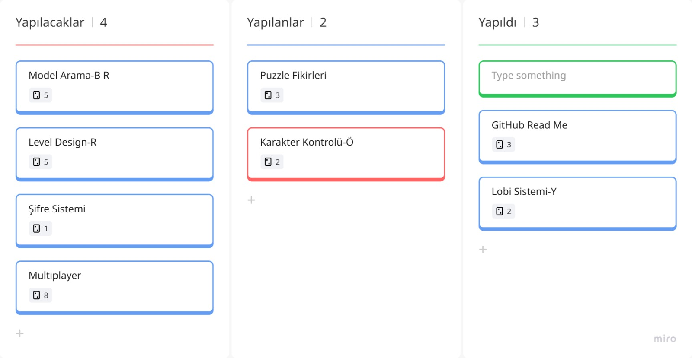
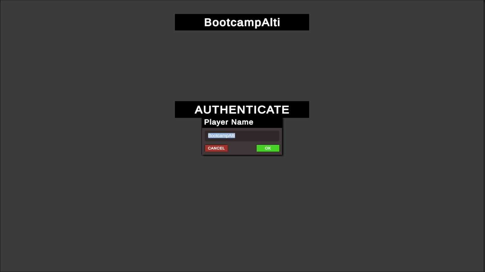
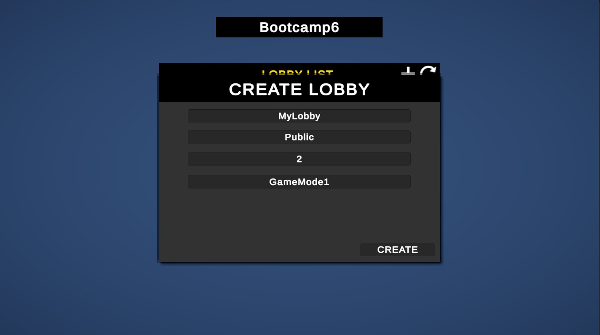
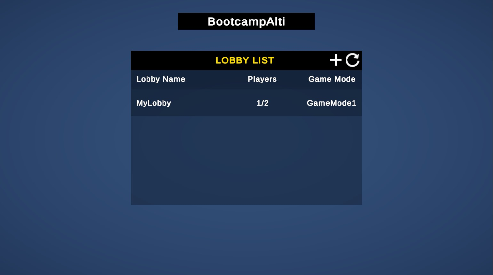
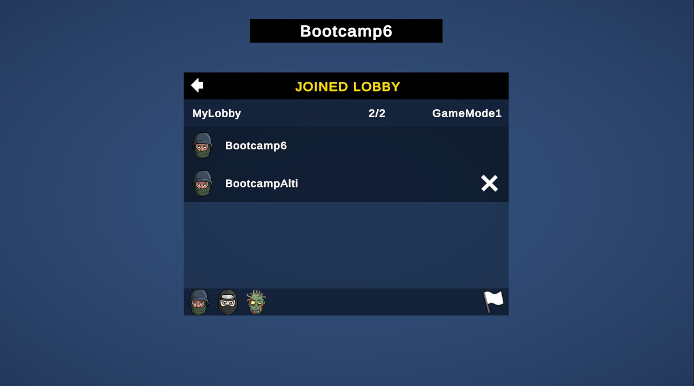
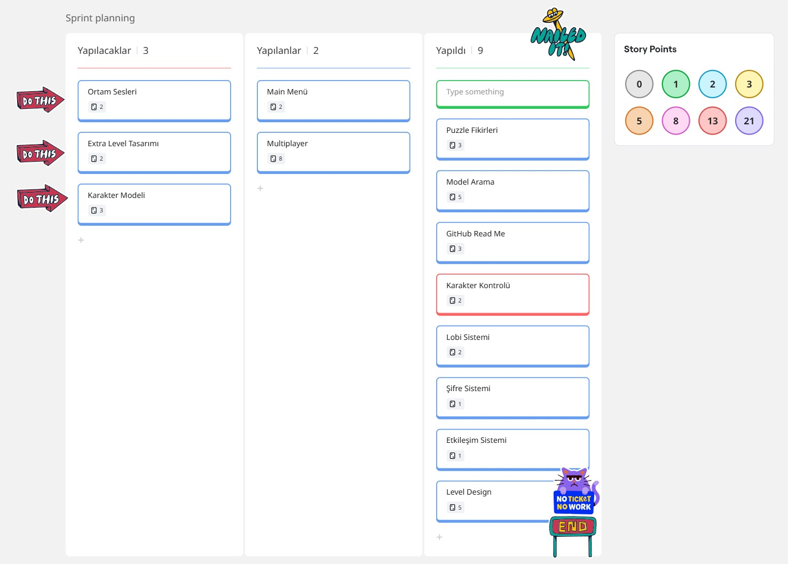
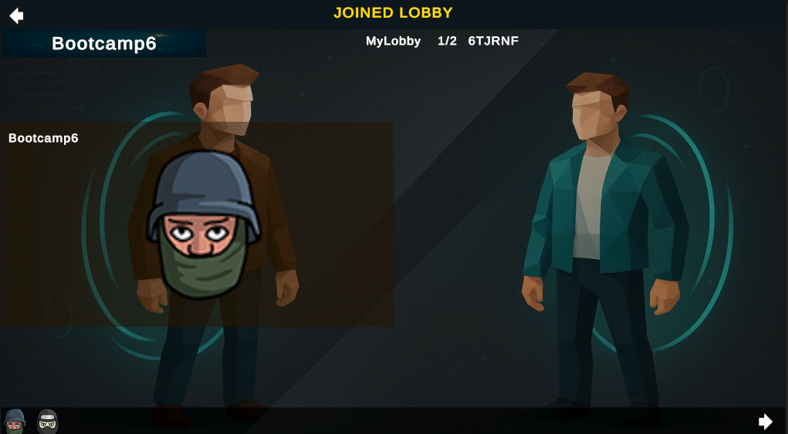
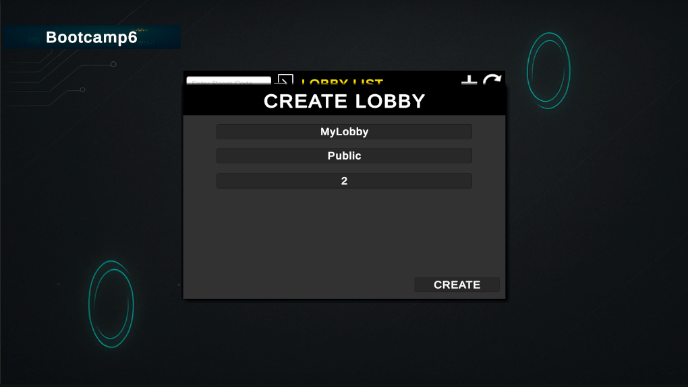
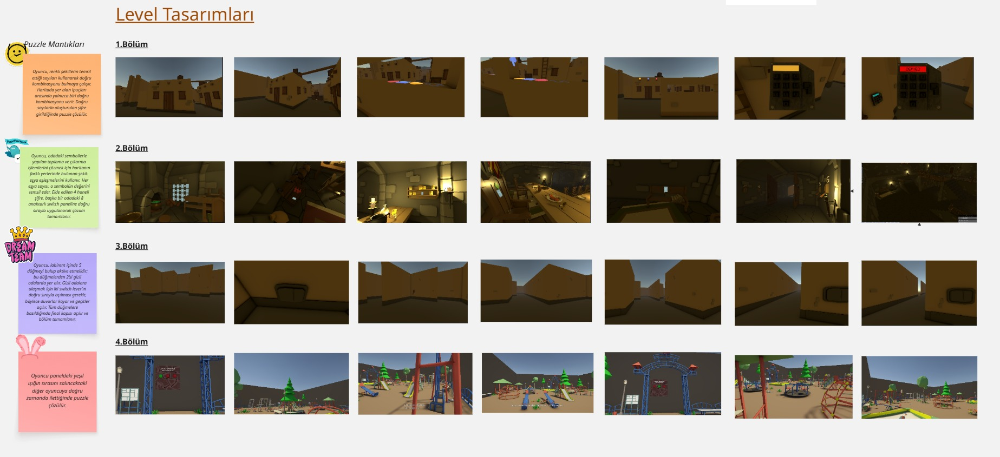

# 🎮 Oyun

## Takım İsmi
**Toplanamayanlar**

## Takım Üyeleri
- **Rana Özcan** - Scrum Master  
- **Yunus Emre Yıldırım** - Product Owner  
- **Batuhan Çetinkaya** - Developer  
- **Ömer Yirmibeş** - Developer  
- **Arzu Ekinli** - Developer  

## Oyun İsmi
**Henüz bulunmadı**

## Oyun Açıklaması

## Oyun Özellikleri
- 3D birinci şahıs kamera ile oynanış
- Co-op veya rekabetçi multiplayer deneyimi
- Oyuncular arasında görev tamamlama ve puan toplama temelli mücadele

## Hedef Kitle
- Eğlenceli ve hızlı tempolu çok oyunculu oyunlara ilgi duyanlar
- Co-op veya rekabetçi mekanikleri deneyimlemek isteyen arkadaş grupları
- Basit görev temelli, puzzle benzeri oyunlardan keyif alan casual oyuncular
- PC oyuncuları
- 7 yaş ve üzeri kullanıcılar

# Sprint 1 - Planlama ve Süreç

## Sprint Hedefleri
Bu sprintte amacımız oyun fikrimizi teknik olarak şekillendirmek ve proje altyapısını hazırlamaktı. Özellikle karakter kontrolü, lobi sistemi ve model arama süreçlerine odaklandık.

---

## Sprint Planı (Sprint Board)

Aşağıda yer alan sprint board ekranı üzerinden görevlerin dağılımı takip edilmiştir:

| Durum        | Görevler                                  |
|--------------|--------------------------------------------|
| Yapılacaklar | Model Arama - Level Design - Şifre Sistemi- Multiplayer |
| Yapılıyor    | Puzzle Fikirleri-Karakter Kontrolü  |
| Yapıldı      | Lobi Sistemi - GitHub ReadMe |

---

### Daily Scrum
Resmi olarak her gün yapılan Daily Scrum toplantılarımız olmadı ancak ekip olarak çoğu akşam kısa toplantılarla bir araya geldik. Bu buluşmalarda o gün yapılan ilerlemeler, karşılaşılan teknik sorunlar ve görev paylaşımı üzerine konuştuk. İletişim ağırlıklı olarak Microsoft Teams ve WhatsApp üzerinden sağlandı. Bu sayede herkes proje gelişmelerinden haberdar oldu ve görev dağılımı netleşti.

## Tahmini Puanlama ve Mantık
- Görevler, karmaşıklıklarına göre 1 ile 5 arasında puanlandı.
- Bu sprintte toplam 8 story point tamamlanması hedeflendi.
- Planlama yapılırken ekip üyelerinin deneyim düzeyi ve önceki görev süreleri dikkate alındı.

## Görseller

### Kullanıcı Doğrulama Ekranı

### Lobby Oluşturma Ekranı

### Lobby Listesi

### Lobby Katılım

---

## Sprint Review
- Tamamlanan iş: GitHub ReadMe hazırlığı ve içeriğin oluşturulması ve lobi sistemi.
- Lobi sistemi işlevsel olarak tamamlandı.
- Bazı görevlerde ilerleme olsa da "Done" statüsüne geçen iş sayısı sınırlı kaldı.

---

## Sprint Retrospective
- İyi Gidenler: Görev dağılımı, iletişim ve planlama başarılıydı.  
- Zorlayanlar: Teknik entegrasyonlarda yaşanan ufak gecikmeler.  
- Gelecek Sprint İçin: Bitmemiş işler önceliklendirilip devam edilecek. Görev tamamlama için daha kısa süreli mini hedefler belirlenecek.

---

Hazırlayan: Scrum Master - Rana

**Sprint Retrospective**
 İyi Gidenler: Görev dağılımı, iletişim ve planlama başarılıydı.

 Zorlayanlar: Teknik entegrasyonlarda yaşanan ufak gecikmeler.

 Gelecek Sprint İçin: Bitmemiş işler önceliklendirilip devam edilecek. Görev tamamlama için daha kısa süreli mini hedefler belirlenecek.

 ## 🔄 Sprint 2 Süreç Özeti

### 🎯 Sprint Hedefleri
Bu sprintte hedefimiz, oyun dünyasının daha fazla şekillenmesi ve temel oynanış mekaniklerinin uygulanabilir hâle gelmesiydi. Level tasarımları, karakter kontrolü, multiplayer entegrasyonu ve lobi arayüzü geliştirme odak noktalarıydı. Puzzle akışı planlandı ve bölümlere göre yerleştirildi.

---

### 📋 Sprint Planı (Sprint Board)

| Durum        | Görevler                                |
|--------------|------------------------------------------|
| Yapılacaklar | Ortam Sesleri, Extra Level Tasarımı, Karakter Modeli |
| Yapılıyor    | Main Menü, Multiplayer                   |
| Yapıldı      | Puzzle Fikirleri, Model Arama, GitHub ReadMe, Karakter Kontrolü, Lobi Sistemi, Şifre Sistemi, Etkileşim Sistemi, Level Design |

---

### 🧮 Tahmin Edilen Puan ve Mantık

Bu sprintte görevler zorluk, belirsizlik ve tahmini süreye göre aşağıdaki şekilde puanlandı:

| Görev                | Tahmini Puan | Gerekçe                                                                 |
|----------------------|--------------|-------------------------------------------------------------------------|
| Puzzle Fikirleri     | 2            | Yaratıcılık ve çeşitlilik gerektirdi ama teknik uygulama yoktu         |
| Model Arama          | 3            | Araştırma süreci zaman aldı, ama uygulama yok                          |
| GitHub ReadMe        | 1            | Dokümantasyon, düşük teknik zorluk                                     |
| Karakter Kontrolü    | 8            | Oynanış açısından kritik, test ve hata ayıklama içeriyordu             |
| Lobi Sistemi         | 5            | UI tasarımı, sunucu bağlantısı ve kullanıcı yönetimi içeriyordu        |
| Şifre Sistemi        | 3            | Belirli bir mantık ve UI ile çalıştı, ama karmaşık değildi             |
| Etkileşim Sistemi    | 5            | Objelerle etkileşimde kontroller ve geri bildirim gerektirdi          |
| Level Design         | 8            | 4 bölüm için çevresel tasarım, zaman ve karar süreci gerektirdi        |
| Multiplayer          | 13           | Teknik olarak en karmaşık kısımdı: senkronizasyon, testler, bağlanma   |

🧠 **Toplam puan: 48 story point**

Tahminler, görevleri tamamlayacak kişilerin deneyimi ve önceki sprintteki ilerlemeye göre yapıldı. Teknik belirsizliği yüksek işler daha yüksek puan aldı.

---

### ☕ Daily Scrum
Takım olarak çoğu akşam kısa değerlendirme konuşmaları gerçekleştirildi. Teams ve WhatsApp üzerinden yapılan bu konuşmalarda görevlerin durumu, yaşanan problemler ve çözüm yolları paylaşıldı.
Daily Scrum notlarımızı görmek için [buraya tıklayın](https://imgur.com/a/daily-scrum-QK5qE7o).

---

### 🖼️ Arayüz ve Oyun Gelişmeleri

#### 📍 Lobby Tasarımı
Lobi arayüzü yenilendi. Oyuncuların avatarları, isimleri ve oyun ayarlarını belirleyebileceği bir ekran geliştirildi.

  
  

#### 🧩 Level Tasarımı ve Puzzle Mantığı
Dört farklı bölüm için çevresel modellemeler ve puzzle senaryoları hazırlandı.

**Puzzle Bölümleri:**

- **1. Bölüm:** Oyuncu, renkli şekillerin temsil ettiği sayıları kullanarak doğru kombinasyonu bulmaya çalışır. Haritada yer alan ipuçları arasında yalnızca biri doğru kombinasyonu verir. Doğru sayılarla oluşturulan şifre girildiğinde puzzle çözülür.
- **2. Bölüm:** Oyuncu, odadaki sembollerle yapılan toplama ve çıkarma işlemlerini çözmek için haritanın farklı yerlerinde bulunan şekil-eşya eşleşmelerini kullanır. Her eşya sayısı, o sembolün değerini temsil eder. Elde edilen 4 haneli şifre, başka bir odadaki 8 anahtarlı switch paneline doğru sırayla uygulanarak çözüm tamamlanır.
- **3. Bölüm:** Oyuncu, labirent içinde 5 düğmeyi bulup aktive etmelidir; bu düğmelerden 2’si gizli odalarda yer alır. Gizli odalara ulaşmak için iki switch lever’ın doğru sırayla açılması gerekir, böylece duvarlar kayar ve geçitler açılır. Tüm düğmelere basıldığında final kapısı açılır ve bölüm tamamlanır.
- **4. Bölüm:** Oyuncu paneldeki yeşil ışığın sırasını salıncaktaki diğer oyuncuya doğru zamanda ilettiğinde puzzle çözülür.

---

### ✅ Sprint Review
Sprint sonunda aşağıdaki geliştirmeler başarıyla tamamlandı:
- 4 farklı level ortamının temel mimarisi oluşturuldu
- Lobi tasarımı tamamlandı
- Puzzle akışı ve bölümlere göre görev zincirleri belirlendi
- Şifre sistemleri ve temel etkileşim sistemleri geliştirildi

---

### 🔍 Sprint Retrospective
**İyi Gidenler:**  
- Görevler zamanında ve paralel ilerledi  
- Tasarım ve programlama arasında iyi iş bölümü sağlandı  
- Puzzle mantıkları oyuna uygun şekilde çeşitlendirildi  

**Geliştirilecek Noktalar:**  
- Takım içi yazılı iletişim daha sistemli hâle getirilmeli  
- Multiplayer testleri için daha fazla eş zamanlı deneme yapılmalı  

**Bir Sonraki Sprint İçin:**  
- Ortam sesleri ve VFX öğeleri eklenecek  
- Ana menüden lobiye geçiş tamamlanacak  
- Oyun içi görev akışı prototiplenecek
- Ara sahne oluşturalacak
- Multiplayer eklenecek
- Extra leveller tasarlanacak.
- Karakter modeli eklenecek.
